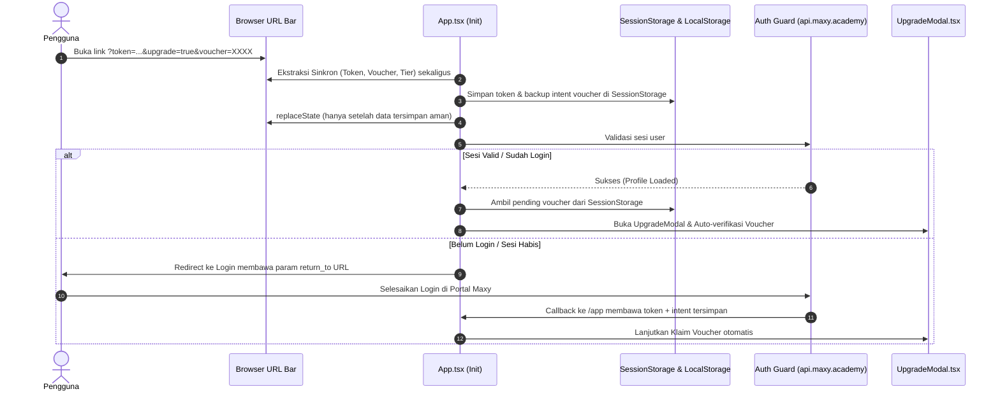

# 📋 Rencana Implementasi (Implementation Plan): AI Navigator [REVISI]

Dokumen ini merinci rencana teknis dan arsitektur untuk menyelesaikan 3 kebutuhan pembaruan pada platform AI Navigator dengan penyesuaian instruksi terbaru:
1. **AI Logo**: Dibuat / di-generate dengan pendekatan **Minimalis**, modern, dan bersih (*sleek geometric line art / negative space*).
2. **Perbaikan Flow Claim Voucher**: Mencegah pengguna terlempar (*throw back*) ke halaman *Select Role* pada portal Maxy Academy.
3. **Limit Karakter Judul Capstone**: Pembatasan ketat judul Capstone Project menjadi **maksimal 50 karakter**, termasuk harmonisasi judul di Bank Capstone.

---

## 📑 Daftar Isi
- [1. Integrasi AI Logo (Gaya Minimalis)](#1-integrasi-ai-logo-gaya-minimalis)
- [2. Perbaikan Alur Klaim Voucher](#2-perbaikan-alur-klaim-voucher)
- [3. Pembatasan Karakter Judul Capstone (Maks 50 Karakter)](#3-pembatasan-karakter-judul-capstone-maks-50-karakter)
- [4. Rencana Kerja & Urutan Eksekusi](#4-rencana-kerja--urutan-eksekusi)
- [5. Skenario Pengujian & Validasi](#5-skenario-pengujian--validasi)

---

## 1. Integrasi AI Logo (Gaya Minimalis)

### 1.1. Konsep & Filosofi Desain Minimalis
Sesuai arahan, logo AI Navigator akan mengusung gaya **Minimalis Modern**:
- **Simbolisme**: Perpaduan geometris minimalis antara kompas penunjuk arah (*Navigator*) dan simpul kecerdasan buatan (*AI Nodes / Core*).
- **Karakter Visual**: Garis bersih (*monoline*), tanpa gradien berlebih yang ramai, menggunakan *negative space* presisi yang langsung dapat dikenali baik pada ukuran kecil (16x16 favicon) maupun ukuran besar di banner.
- **Palet Warna**: Aksen *electric indigo* / *cyan glow* minimalis dengan latar transparan yang kontras sempurna pada Dark Mode (`#070b14` / `#0f172a`) maupun Light Mode (`#ffffff` / `#f8fafc`).

### 1.2. Spesifikasi Aset yang Dihasilkan
1. **Logo Vektor SVG Minimalis** (`public/logo-ai-navigator.svg`):
   - Format skalar SVG murni (ringan, < 3KB, tajam tanpa pikselasi di semua resolusi layar Retina/4K).
   - Adaptif terhadap tema gelap dan terang menggunakan CSS currentColor / fill transparan.
2. **Favicon Browser** (`public/favicon-ai.svg` & `public/favicon-ai.png`):
   - Ikon minimalis resolusi 32x32 dan 64x64 untuk tab browser.
3. **Komponen Inline Fallback** (`src/components/AiNavigatorLogo.tsx`):
   - Komponen React mandiri yang merender SVG minimalis dengan animasi mikro rotasi kompas halus saat di-hover.

### 1.3. Titik Integrasi pada Kode
| File | Rencana Perubahan |
| :--- | :--- |
| `index.html` | Mengganti favicon lama dengan favicon AI Navigator minimalis baru. |
| `src/components/Header.tsx` | Memperbarui navbar brand: menampilkan logo AI Navigator minimalis di samping identitas kemitraan Maxy Academy. |
| `src/components/LearningPathRoadmap.tsx` | Memperbarui Hero Banner dengan logo AI Navigator minimalis. |
| `src/components/CertificateModal.tsx` | Menyematkan cap/insignia AI Navigator minimalis pada header akreditasi sertifikat. |
| `src/App.tsx` | Memperbarui footer aplikasi dengan logo minimalis baru. |

---

## 2. Perbaikan Alur Klaim Voucher

### 2.1. Akar Masalah (Root Cause Analysis)
Terlemparnya pengguna kembali ke halaman **Select Role** di portal Maxy Academy disebabkan oleh beberapa faktor berantai:

1. **Race Condition di `App.tsx`**:
   - Pada `useEffect` pertama (`src/App.tsx` L294-L314):
     ```typescript
     if (upgradeParam === 'true') {
       window.history.replaceState({}, document.title, window.location.pathname);
       ...
     }
     ```
     `replaceState` dieksekusi terlalu dini dan menghapus seluruh query parameter dari URL sebelum `useEffect` Auth Guard (L346) sempat membaca parameter `token` dan `refresh_token`.
2. **Autentikasi Terputus & Redirect Tanpa Konteks**:
   - Karena `token` dari URL terhapus sebelum diproses, Auth Guard menganggap user belum login (`!token`).
   - Sistem memanggil `redirectToLogin()`:
     ```typescript
     window.location.href = 'https://ainavigator.maxy.academy?login=true';
     ```
   - Redirect ini tidak menyertakan parameter `return_to` atau informasi bahwa user sedang dalam proses klaim voucher AI Navigator.
3. **Penyimpangan ke Alur "Select Role"**:
   - Ketika user login atau mendaftar di portal Maxy Academy, sistem auth pusat mendeteksi user belum melengkapi profil/role umum portal Maxy, sehingga diarahkan ke onboarding `/select-role`.
   - Konteks promo dan voucher yang awalnya ingin diklaim di AI Navigator menjadi hilang total.

### 2.2. Solusi Teknis & Rencana Perbaikan



### 2.3. Langkah Implementasi Kode
1. **Unifikasi Pembacaan Query URL di `src/App.tsx`**:
   - Satukan pembacaan parameter URL di satu blok awal:
     - Ambil `tokenFromUrl`, `refreshTokenFromUrl`, `upgradeParam`, `tierParam`, `voucherParam`.
   - Simpan `token` ke `localStorage` seketika.
   - Simpan `pending_voucher` dan `pending_tier` ke `sessionStorage` agar tetap bertahan meskipun ada reload atau redirect login.
   - Jalankan `window.history.replaceState` hanya setelah semua nilai di atas diamankan ke dalam storage.
2. **Dukungan Parameter Redirect pada `redirectToLogin`**:
   - Ubah pemanggilan redirect agar membawa target URL kembali:
     ```typescript
     const returnUrl = encodeURIComponent(window.location.origin + '/app?upgrade=true&voucher=' + voucherCode);
     window.location.href = `https://ainavigator.maxy.academy?login=true&redirect=${returnUrl}`;
     ```
3. **Pemulihan Voucher Otomatis Pasca-Auth**:
   - Setelah validasi profil (`fetchUserProfile`) selesai, periksa apakah terdapat `pending_voucher` di `sessionStorage`.
   - Jika ada, set state `upgradePrefilledVoucher`, buka `UpgradeModal`, dan hapus dari `sessionStorage` setelah berhasil diverifikasi.
4. **Penanganan Voucher Giveaway / Diskon 100%**:
   - Pada `handleUpgradeTier` di `src/App.tsx`, pastikan jika voucher bernilai 100% (tagihan Rp 0), aktivasi tier langsung diproses tanpa mengarahkan user ke halaman invoice eksternal yang rawan bounce.

---

## 3. Pembatasan Karakter Judul Capstone (Maks 50 Karakter)

### 3.1. Kebijakan Batasan Baru (50 Karakter)
- **Batas Maksimal**: **50 karakter** (sesuai instruksi revisi user).
- **Batas Minimal**: **8 karakter** (mencegah judul yang terlalu pendek/kosong).

### 3.2. Penyesuaian Komponen `src/components/CapstoneModal.tsx`
1. Definisikan konstanta panjang karakter:
   ```typescript
   export const MAX_CAPSTONE_TITLE_LENGTH = 50;
   export const MIN_CAPSTONE_TITLE_LENGTH = 8;
   ```
2. Pasang atribut `maxLength={MAX_CAPSTONE_TITLE_LENGTH}` pada elemen `<input>` judul.
3. Tambahkan indikator penghitung karakter real-time:
   - Menampilkan `{title.length}/50 karakter`.
   - Warna teks abu-abu saat `< 40 karakter`.
   - Warna amber/oranye saat mendekati batas (`40 - 49 karakter`).
   - Warna merah/rose saat mencapai `50 karakter`.
4. Tambahkan validasi pada `handleSubmit`:
   ```typescript
   if (title.trim().length > MAX_CAPSTONE_TITLE_LENGTH) {
     newErrors.title = `Judul Capstone maksimal ${MAX_CAPSTONE_TITLE_LENGTH} karakter.`;
   } else if (title.trim().length < MIN_CAPSTONE_TITLE_LENGTH) {
     newErrors.title = `Judul Capstone minimal ${MIN_CAPSTONE_TITLE_LENGTH} karakter.`;
   }
   ```

### 3.3. Harmonisasi Bank Capstone (`src/data/capstoneBank.ts`)
Beberapa topik default di Bank Capstone sebelumnya memiliki panjang 51–59 karakter. Semua topik akan disederhanakan agar seluruhnya **<= 50 karakter**, sehingga saat siswa memilih topik dari Bank Capstone tidak akan melebihi kuota 50 karakter:

| ID Topik | Judul Sebelumnya (Panjang) | Judul Baru yang Disesuaikan (Panjang) |
| :--- | :--- | :--- |
| `rag-customer-support` | Otomasi AI Customer Support & Knowledge Base RAG (48) | **Otomasi AI Customer Support & RAG Knowledge** (44 char) ✅ |
| `marketing-content-engine` | AI Marketing Omnichannel & Content Personalization Engine (57) | **AI Marketing & Content Personalization Engine** (44 char) ✅ |
| `financial-report-analyzer` | Automated Financial Report Analyzer & Executive Summary AI (59) | **Automated Financial Report Analyzer AI** (38 char) ✅ |
| `hr-resume-screening` | AI Resume Screening & Anti-Bias Candidate Shortlisting (54) | **AI Resume Screening & Candidate Shortlist** (41 char) ✅ |
| `legal-contract-review` | AI Legal Contract Review & Risk Assessment Agent (49) | **AI Legal Contract Review & Risk Agent** (38 char) ✅ |
| `ai-code-reviewer` | AI-Powered Code Reviewer & Security Vulnerability Scanner (58) | **AI-Powered Code Reviewer & Security Scanner** (43 char) ✅ |
| `smart-medical-summarizer` | Smart Clinical Notes & SOAP Medical Record Summarizer (53) | **Clinical Notes & SOAP Medical Record AI** (40 char) ✅ |
| `adaptive-learning-tutor` | Adaptive AI Socratic Tutor & Dynamic Quiz Generator (51) | **Adaptive AI Socratic Tutor & Quiz Generator** (43 char) ✅ |

### 3.4. Safeguard pada Sertifikat (`src/components/CertificateModal.tsx`)
Dengan batasan 50 karakter, judul dipastikan fit secara sempurna dalam 1 baris pada sertifikat landscape standar tanpa risiko terpotong. Tetap ditambahkan CSS `truncate max-w-full` sebagai perlindungan visual ganda.

---

## 4. Rencana Kerja & Urutan Eksekusi

```
[Tahap 1] Pembatasan 50 Karakter Judul Capstone
   ├── Update CapstoneModal.tsx (maxLength=50, counter badge, validasi form)
   ├── Harmonisasi topik Bank Capstone (capstoneBank.ts <= 50 karakter)
   └── Validasi render pratinjau sertifikat di CertificateModal.tsx

[Tahap 2] Perbaikan Alur Klaim Voucher & Auth Race Condition
   ├── Unifikasi pembacaan query URL (?token, ?voucher, ?tier, ?upgrade) di App.tsx
   ├── Simpan state pending voucher di sessionStorage
   ├── Koreksi timing window.history.replaceState
   ├── Update return_to parameter pada redirectToLogin
   └── Auto-verifikasi pending voucher saat user berhasil login

[Tahap 3] Pembuatan & Integrasi AI Logo Minimalis
   ├── Buat aset vektor logo AI Navigator minimalis (SVG)
   ├── Pasang favicon minimalis di index.html
   ├── Integrasikan logo di Header.tsx (Dark & Light mode ready)
   ├── Integrasikan logo di LearningPathRoadmap.tsx & CertificateModal.tsx
   └── Perbarui footer App.tsx

[Tahap 4] Pengujian & Build Validasi
   ├── Validasi TypeScript & linting (npm run lint)
   ├── Uji coba input capstone (panjang > 50 diblokir, pilih dari bank lolos)
   ├── Simulasi klaim voucher link (?upgrade=true&voucher=...)
   └── Verifikasi tampilan visual logo minimalis
```

---

## 5. Skenario Pengujian & Validasi

| No | Komponen / Alur | Kondisi Uji | Ekspektasi Hasil |
| :---: | :--- | :--- | :--- |
| **1** | Input Judul Capstone | Ketik lebih dari 50 karakter | Input berhenti di karakter ke-50 (`maxLength`), counter menunjukkan `50/50`, teks counter berwarna merah. |
| **2** | Bank Topik Capstone | Klik salah satu dari 8 topik di Bank Capstone | Judul terisi otomatis dengan panjang <= 50 karakter, tidak ada pesan error validasi. |
| **3** | Input Judul Capstone | Ketik kurang dari 8 karakter lalu klik simpan | Muncul pesan error validasi: "Judul Capstone minimal 8 karakter." |
| **4** | Alur Voucher (Belum Login) | Akses `/app?upgrade=true&voucher=AIHEMAT` | Parameter voucher tersimpan di `sessionStorage`, diarahkan login dengan URL redirect balik, setelah login voucher langsung terbuka dan siap klaim. |
| **5** | Alur Voucher (Sudah Login) | Akses `/app?upgrade=true&voucher=AIHEMAT` | Token URL tidak terhapus sebelum dibaca, modal langsung terbuka dengan kode voucher terisi otomatis. |
| **6** | AI Logo Minimalis | Tampilan Navbar & Favicon pada Desktop & Mobile | Logo tampil minimalis, tajam, proporsional, dan elegan pada tema Dark maupun Light. |

---

## 6. Status Eksekusi

| Tahap | Status | Catatan |
| :--- | :---: | :--- |
| 1. Limit 50 karakter | Selesai | `CapstoneModal.tsx`: `maxLength`, validasi 8-50, counter. `capstoneBank.ts`: 6 judul dipersingkat. |
| 2. Flow voucher | Selesai (perlu uji di staging) | `App.tsx`: effect upgrade tidak lagi menghapus `token`; niat klaim disimpan di `sessionStorage`; modal dibuka setelah auth selesai. |
| 3. AI Logo | Selesai | `public/logo-ai-navigator.svg`, dipasang di favicon, Header, hero Peta Belajar, footer. |
| 4. Verifikasi | Lihat ringkasan akhir | |

### Penyimpangan dari rencana awal
- **Judul bank**: hanya 6 dari 8 yang melebihi 50 karakter (`rag-customer-support` 48 dan `legal-contract-review` 48 sudah aman, tidak diubah). Angka panjang di tabel 3.3 adalah perkiraan; nilai sebenarnya diukur lewat script.
- **Parameter `redirect` pada `redirectToLogin`**: tidak ditambahkan. Landing berada di repo lain dan belum diketahui apakah mendukung parameter itu. Sebagai gantinya `sessionStorage` dipakai, karena landing dan app satu origin (`ainavigator.maxy.academy`) sehingga data bertahan selama tab yang sama.
- **Komponen `AiNavigatorLogo.tsx`**: tidak dibuat. Logo berupa file lokal di `public/`, jadi tidak ada risiko gagal-muat seperti URL CMS eksternal.
- **Sertifikat dan invoice**: logo Maxy Academy dipertahankan karena itu dokumen akreditasi/penagihan. Judul 50 karakter sudah muat di wrapper sertifikat yang memang `wordBreak: break-word`, jadi `truncate` tidak diperlukan.
- **Batas minimal 8 karakter** ditetapkan sendiri (belum diminta user).

*Dokumen revisi ini siap dijadikan panduan eksekusi pengerjaan.*
